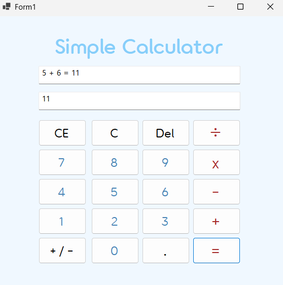
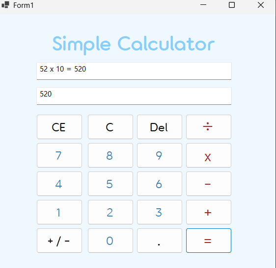
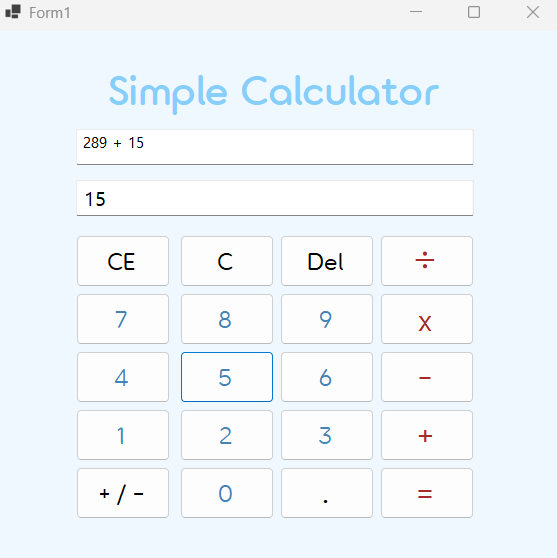
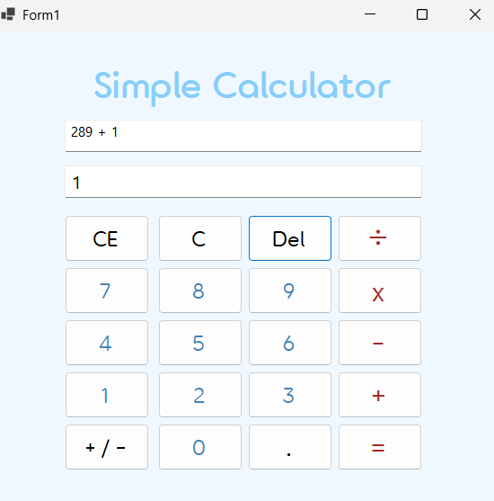
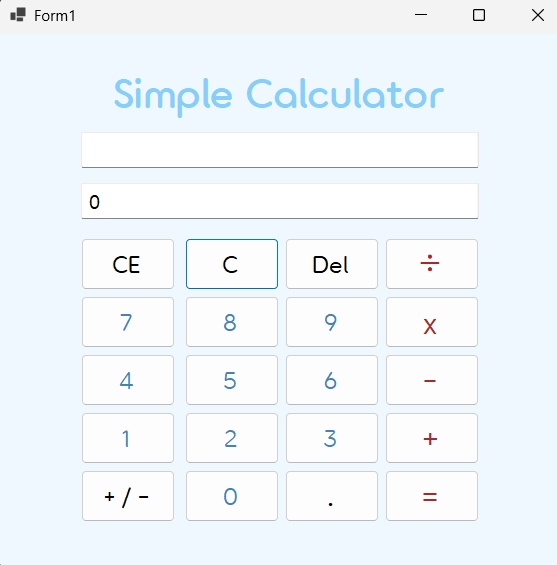
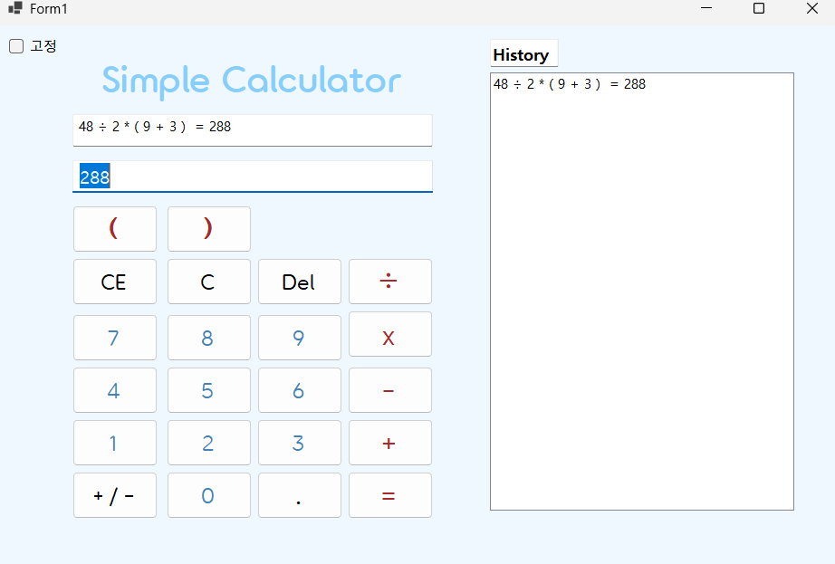

# [C# 코딩] 나만의 계산기

## 개요
- C# 프로그래밍 학습
- 1줄 소개 : 사칙연산을 수행할 수 있는 계산기를 제작합니다. 
- 사용한 플랫폼 : C#, .NET Windows Forms, Visual Studio, Github.
- 사용한 컨트롤: Button, Label, TextBox 등

## 실행 화면 (과제1)
- 과제1 코드의 실행 스크린 샷

- 과제 내용
	- TextBox(입력표시, 결과표시), Button(계산) 등을 적절히 배치합니다.
	- 숫자 Button을 클릭 시, TextBox에 표시합니다. 숫자 입력 기능을 구현합니다.
	- 2개의 피연산자의 입력값을 Int로 바꾸어 더하기 계산을 수행하고 그 결과를 저장합니다. 
	- 계산 결과 값을 문자열로 변환하여 표시합니다.
	
- 구현 내용과 기능 설명
	- 컨트롤 배치와 기본적인 속성을 설정하고, 입력 내용을 2가지 방법으로 표시합니다.
	- 계산기의 더하기 기능을 구현하였습니다. 숫자 버튼을 클릭하여 숫자를 띄우고 더하기 버튼을 통해 더하기 계산 또한 수행합니다. 이후 출력합니다.
	- 피연산자가 하나씩 표시되지 않아, txtResult로 지정한 함수쪽을 다시 수정하였습니다.
	
## 실행 화면 (과제2)
- 과제2 코드의 실행 스크린 샷(곱셈)

- 과제2 코드의 실행 스크린 샷(나눗셈)

- 과제 내용
	- 빼기, 곱하기, 나누기를 구현합니다. 기존에는 아무런 실행을 할 수 없었던 버튼에게 기능을 추가합니다.

- 구현 내용과 기능 설명
	- 각 버튼을 클릭 시 연산자만 변경하여 동일한 로직을 적용시킵니다. 사칙연산이 가능해집니다. 

## 실행 화면 (과제3)
- 과제3 코드의 실행 스크린 샷 (기존수식)

- 과제3 코드의 실행 스크린 샷 (Del사용)

- 과제3 코드의 실행 스크린 샷 (C 사용)

- 과제 내용
	- 계산기에 있는 수정/삭제 기능을 구현합니다. C, CE, Del버튼을 도입합니다. 

- 구현 내용과 기능 설명
	- 현재의 모든 내용을 삭제하고 처음 (초기화) 상태로 되돌아가는 C 버튼을 추가합니다.
	- 마지막으로 입력한 피연산자(Operand) 값을 삭제하는 CE 버튼을 추가합니다. 
	- 마지막으로 입력된 글자 하나 (숫자 하나) 값을 삭제하는 Del 버튼을 추가합니다. (Ex - 100을 입력했다면 10으로 바뀜)
	- txtResult 값을 보다 편의성 있게 바꾸기 위해서 폰트 크기를 키웠습니다. (9pt -> 12pt)
- 수정 내용
	- CE 버튼을 눌렀을 때 txtNum1에서 0이 보이는 현상을 수정하였습니다.

## 실행 화면 (과제4)
- 과제4 코드의 실행 스크린 샷

- 과제 내용
	- 사용자 편의 기능을 추가합니다. 쉽고 편하게 사용할 수 있도록 기능을 도입합니다.

- 구현 내용과 기능 설명
	- 키보드를 사용하여 숫자와 연산자를 입력할 수 있도록 기능을 추가합니다. (숫자키, +, -, *, /, Enter)
	- checkBox를 추가하여 다른 창보다 위에서 실행될 수 있도록 고정하는 기능을 추가하였습니다.
	- ListBox를 추가하여 계산 기록을 남기는 기능을 추가하였습니다. 계산이 수행될 때마다 계산식과 결과가 ListBox에 추가됩니다.
	- 괄호 기능을 추가하여 연산의 우선순위를 지정할 수 있도록 하였습니다. 괄호 버튼을 추가하여 사용자가 괄호를 입력할 수 있도록 하였습니다. 계산 로직을 수정하여 괄호가 포함된 수식을 올바르게 계산할 수 있도록 구현하였습니다.
	- 키보드로도 괄호를 입력받을 수 있도록 수정하였습니다.